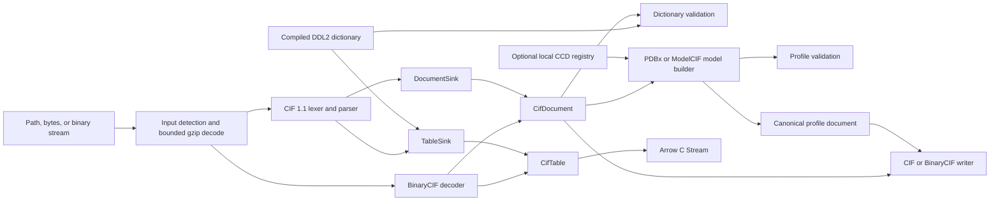

# Nibbler design

- Status: current implementation
- Updated: 2026-08-12
- Schema targets: PDBx/mmCIF 5.416 and ModelCIF 1.4.9
- Engineering rules: [ENGINEERING.md](ENGINEERING.md)

This document describes the code that exists in this repository. It is not a roadmap.
Historical experiments, including approaches that were measured and not retained, are
recorded only in [docs/improvement-beam.md](docs/improvement-beam.md).

## 1. Purpose

Nibbler is a native Python and Rust toolkit for CIF 1.1, PDBx/mmCIF, and ModelCIF. It
has three jobs:

1. parse a complete CIF document without losing its logical structure;
2. project one category directly into typed columnar storage; and
3. build, validate, and write immutable PDBx or ModelCIF semantic models.

Parsing is strict. Nibbler does not silently repair syntax, guess chemistry, fetch
network data, or collapse CIF's unknown (`?`) and not-applicable (`.`) states.

## 2. System shape



There is one production lexer and parser for text CIF. `DocumentSink` retains the
logical document; `TableSink` projects one category. BinaryCIF has its own MessagePack
codec, but produces the same `CifDocument` and `CifTable` types. Dictionary validation,
semantic construction, and profile validation operate above those shared types.

The implementation is one Rust crate exposed through a thin PyO3 boundary and a small,
typed Python facade. There is no plugin system, service layer, or second Python parser.

## 3. Input and formats

`nibbler.cif.read()` accepts:

- filesystem paths;
- `bytes`, `bytearray`, and `memoryview`;
- binary file objects whose `read()` method returns bytes-like data.

Text CIF, gzip, and BinaryCIF 0.3 are detected from content. A suffix does not control
input decoding. Gzip decompression is bounded by compressed size, decompressed size,
and expansion ratio. Ordinary parsing never performs network access.

Rust input is moved into an immutable, reference-counted `SourceBuffer`. Parsed text
documents retain source spans instead of allocating one string per value. A
`CifDocument` stores its immutable block slice behind `Arc`, so cloning a document is
constant-time.

## 4. Text grammar and logical document

The lexer accepts UTF-8 CIF 1.1 and rejects forbidden control characters. The parser
handles:

- data and global blocks;
- scalar tags and values;
- loops with complete rows;
- single- and double-quoted values;
- semicolon text fields;
- comments;
- save frames; and
- unquoted control words with ASCII-insensitive matching.

Duplicate tags, invalid UTF-8, malformed quotes or text fields, incomplete loop rows,
unexpected control words, and resource-limit failures produce located structured
errors. Quoted strings that resemble control words remain values.

`CifDocument` preserves block, entry, loop, tag, value, and frame order. Generic CIF
loops remain distinct even when their tag prefixes match. Comments and inter-token
whitespace are syntax, not part of the logical model, and are not retained.

Parsed loop values are compact 8-byte source descriptors. Quote style, text bounds, and
missing kind are derived from the shared source when needed. BinaryCIF documents retain
decoded typed columns rather than expanding them into a row-major value graph.

The value model distinguishes:

- present text;
- finite integers;
- finite floating-point values and standard uncertainty;
- unknown (`?`); and
- not applicable (`.`).

Schema-less text CIF values remain text. Dictionary-guided projection parses declared
integer and floating-point items into typed columns.

## 5. Projection and Arrow

Passing `category=` to `cif.read()` selects one category and returns a `CifTable`.
`columns=` selects output items; omitting it keeps source item order. `where=` is applied
while parsing, including when the predicate item is not returned. Supported conditions
are equality, inequality, membership, either missing state, and a specific missing
state. Python callbacks never run in the native row loop.

Without a schema, projected columns are UTF-8. With `schema="pdbx"` or
`schema="modelcif"`, the compiled dictionary selects UTF-8, `int64`, or `float64` and
invalid values fail at their source location. Unknown items in a schema-guided
projection produce a structured error.

`CifTable` owns segmented Arrow-compatible buffers and exports the Arrow C Stream
protocol. PyArrow, Polars, and pandas are optional consumers, not runtime dependencies.
At that boundary the caller chooses one missing-value policy:

- `collapse`: map both CIF missing states to Arrow null;
- `columns`: add companion columns that encode the exact missing state; or
- `extension`: expose Nibbler's missing-state extension representation.

## 6. Concurrency and performance architecture

The Python facade releases the GIL during native reads. `cif.scan()` admits at most one
source per worker, parses independent sources concurrently, and yields successful
results in input order. It either raises the first input-ordered error or collects
structured `BatchError` values; there is no silent-skip mode.

When at least 8 MiB remains from a loop's first value, the loop may use bounded
intra-file parallelism. Document retention first proves that the loop itself reaches
that threshold. The serial parser remains the sole owner of block, frame, tag, and loop
grammar. A process-wide lease makes concurrent intra-file loop kernels share the host's
available parallelism; the outer file-scan pool is bounded separately. For a qualifying
loop Nibbler:

1. finds safe source ranges using an exact semicolon-text boundary state machine;
2. tokenizes and validates ranges with the production lexer;
3. retains compact source cells directly for full documents; or
4. projects chunks speculatively and commits them only after prefix counts prove row
   alignment, otherwise using the general aligned path.

All outputs and errors are merged in source order. Small loops stay serial. Custom
resource limits that could become observable also use the serial path. The current
mechanisms and qualification results are documented in
[docs/performance-report.md](docs/performance-report.md).

## 7. Dictionaries and validation

The repository pins exact PDBx 5.416 and ModelCIF 1.4.9 dictionary inputs in
`schemas/locks.toml`. Deterministic compiled `.nbs` artifacts are embedded in the
extension, digest-checked, and initialized lazily. Parsing and validation never fetch
schemas.

Validation levels are deliberately distinct:

1. **syntax**: successful strict parse;
2. **dictionary**: known categories/items, DDL2 types, mandatory definitions,
   enumerations, numeric ranges, category keys, and parent-child links; and
3. **profile**: coherent PDBx coordinate or ModelCIF prediction semantics.

A weaker level is never reported as a stronger one. Reports contain stable codes,
severity, messages, context, dictionary version, and explicit coverage. Diagnostics are
deterministically ordered and capped at 10,000 plus a truncation warning.

## 8. PDBx semantics and chemistry

`nibbler.mmcif.read(..., profile="pdbx")` requires exactly one data block and builds an
immutable, source-backed coordinate model. It represents:

- polymer, non-polymer, water, and branched entities;
- asymmetric units and polymer/non-polymer/branch schemes;
- chemical component definitions, atoms, and bonds;
- atom sites with label and author identifiers; and
- explicit `struct_conn` endpoints.

Category rows borrow document values. Loop rows share one per-loop item-to-column map,
so semantic construction does not allocate a dictionary for every row. The semantic
model retains an inexpensive shared clone of its source document.

Referenced components resolve deterministically in this order:

1. definitions embedded in the input document;
2. a caller-selected immutable local CCD registry;
3. Nibbler's small built-in definitions for standard amino acids, water, and common
   ions; or
4. an explicit unresolved component.

Conflicting embedded and local definitions fail construction. Unresolved components
remain visible on read but fail strict profile validation, which semantic writing uses
by default. Nibbler does not infer components, bonds, charges, or entity kind from atom
names or distances.

## 9. ModelCIF semantics

`profile="modelcif"` extends the same PDBx coordinate graph with immutable typed
records for targets, prediction models and groups, software and protocol provenance,
templates and alignments, QA metric definitions and values, associated files, and
archive members.

Profile validation checks required metadata and references across those records.
Local QA confidence is not treated as a crystallographic displacement value. A caller
may explicitly mirror one local QA metric into output B factors for a viewer-oriented
file; the original QA records remain intact and the operation is unavailable in
preserving mode.

## 10. Writing

Generic writing accepts only `CifDocument`; semantic writing accepts only
`MmcifModel`. A dataframe is not a complete CIF document and is therefore not accepted
as an implicit writer input.

Text output has two modes:

- `canonical`: deterministic quoting, numeric formatting, category ordering for
  semantic models, `\n` line endings, and one final newline;
- `preserve`: source entry order and valid original quote/numeric lexemes, with
  deterministic layout.

Preserving mode is not byte preservation: comments and original whitespace were not
stored. BinaryCIF output is deterministic and supports canonical mode only.

Text CIF is the default stream format; BinaryCIF is selected explicitly for a stream or
inferred from `.bcif` and `.bcif.gz` paths. Gzip is inferred from a path ending in
`.gz`. Filesystem writes serialize, optionally validate, flush, `fsync`, and atomically
replace the destination. A failed write leaves an existing destination unchanged.
Binary streams are written directly and checked for short writes.

## 11. Python API

The root facade is intentionally four operations:

| Root function | Conventional API | Result |
| --- | --- | --- |
| `nibbler.chomp()` | `nibbler.cif.read()` | `CifDocument` or one projected `CifTable` |
| `nibbler.feast()` | `nibbler.cif.scan()` | bounded, ordered `ScanResult` |
| `nibbler.sniff()` | `cif.validate()` or `mmcif.validate()` | `ValidationReport` |
| `nibbler.dump()` | `cif.write()` or `mmcif.write()` | transactional output |

`chomp` and `feast` are exact aliases, not alternate implementations. `sniff` and
`dump` dispatch only from explicit `schema=` or `profile=` arguments and Nibbler types.

```python
import nibbler

atoms = nibbler.chomp(
    "structure.cif.gz",
    category="atom_site",
    columns=["label_comp_id", "Cartn_x", "Cartn_y", "Cartn_z"],
    where={"pdbx_PDB_model_num": 1},
    schema="pdbx",
)
frame = atoms.to_polars(missing="columns")

document = nibbler.chomp("structure.bcif", schema="pdbx")
nibbler.sniff(document).raise_for_errors()

model = nibbler.mmcif.read(document, profile="pdbx")
nibbler.sniff(model, profile="pdbx").raise_for_errors()
nibbler.dump(model, "canonical.cif.gz", profile="pdbx")
```

Public failures derive from `NibblerError`: `ParseError`, `ProjectionError`,
`SchemaError`, `ChemistryError`, `WriteError`, `BatchError`, and `ValidationError`.
Parse and batch errors retain source name, byte span, and display line/column when
available.

## 12. Resource and safety contract

The Rust crate forbids unsafe code. File contents and Python arguments must not cause a
panic. Checked sizes and explicit limits bound adversarial allocation. Default text
limits include 2 GiB input, 64 MiB per token, 100,000 blocks, 1,000,000 frames,
10,000,000 loops and tags, 100,000 loop columns, and 1,000,000,000 rows and values.
Default gzip limits are 2 GiB compressed, 2 GiB decompressed, and a 1,000-fold expansion
ratio.

Determinism covers logical output, canonical bytes, validation order, batch order, and
the selected earliest parse error across worker counts.

## 13. Deliberate non-goals

Nibbler does not provide:

- a mutable Model/Chain/Residue/Atom hierarchy;
- dataframe-to-document or dataframe-to-semantic-model inference;
- CIF 2.0 or arbitrary STAR nesting;
- transparent PDB conversion;
- online CCD or dictionary downloads during library operations;
- deposition-readiness claims;
- distance-based chemistry inference;
- ML residue vocabularies, atom14 conversion, featurization, or filtering policy; or
- a general query language or Python predicate callbacks.

## 14. Repository boundaries

```text
src/cif/          syntax, source ownership, projection, Arrow, dictionaries, validation,
                  BinaryCIF, and generic writers
src/pdbx/         coordinate semantics, component resolution, profile checks, writer
src/modelcif/     prediction semantics, profile checks, writer
src/python*.rs    PyO3 conversion and native scan orchestration
python/nibbler/   typed public Python facade and optional dataframe adapters
schemas/          pinned dictionary locks and compiled artifacts
benchmarks/       correctness-qualified benchmark adapters and corpus manifest
tools/            schema, corpus, fixture, and PGO workflows
tests/            Rust, Python, corpus, and interoperability acceptance tests
fuzz/             lexer, parser-round-trip, and formatter fuzz targets
```

The current engineering gates are in [ENGINEERING.md](ENGINEERING.md). Benchmark usage
is in [benchmarks/README.md](benchmarks/README.md), current performance qualification is
in [docs/performance-report.md](docs/performance-report.md), and historical performance
experiments are isolated in [docs/improvement-beam.md](docs/improvement-beam.md).
