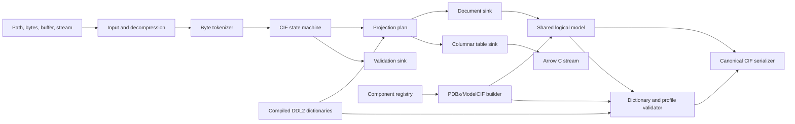

# Nibbler Detailed Design Specification

- Status: Draft 0.1
- Date: 2026-08-11
- Initial schema targets: PDBx/mmCIF 5.416 and ModelCIF 1.4.9
- Audience: implementers, reviewers, and downstream users in structural biology and machine learning
- Engineering standard: [ENGINEERING.md](ENGINEERING.md)

This document defines Nibbler's initial architecture and public contract. The words
MUST, MUST NOT, SHOULD, SHOULD NOT, and MAY are normative.

## 1. Summary

Nibbler is a native Python CIF toolkit for fast dataframe-oriented analysis and for
producing correct, deterministic PDBx/mmCIF and ModelCIF files. Its core will be
implemented in Rust and exposed through a small PyO3 layer.

Nibbler has two equally important jobs:

1. Parse CIF into projected, typed, columnar data without constructing Python object
   graphs or decoding unrequested values.
2. Write syntactically correct and semantically coherent files by constructing and
   validating the full category graph, not merely an `_atom_site` loop.

The same CIF grammar, value model, compiled dictionaries, diagnostic types, and
category tables serve both jobs. Parsing and writing MUST NOT evolve as independent
implementations.

Nibbler is optimized for PDBx/mmCIF and ModelCIF, but its syntax layer supports generic
CIF 1.1 documents. Chemistry and macromolecular semantics live above the syntax layer.

## 2. Goals

### 2.1 Functional goals

Nibbler MUST:

- Parse CIF 1.1 files, including multiple data blocks, scalar items, loops, comments,
  quoted values, multiline values, and save frames.
- Read paths, bytes, buffer-protocol objects, and file-like objects.
- Detect gzip by content and support `.cif.gz` and `.mmcif.gz` without a decompressed
  intermediate file.
- Project selected blocks, categories, columns, and simple row predicates during parse.
- Produce typed columnar output and export it through the Arrow C Data Interface.
- Preserve the difference between CIF unknown (`?`) and not-applicable (`.`) values.
- Parse many independent files concurrently while releasing the Python GIL.
- Write generic CIF 1.1 documents deterministically.
- Build complete PDBx coordinate models and ModelCIF prediction models from typed input.
- Represent polymers, non-polymers, water, ions, branched entities, chemical components,
  and inter-component connections without collapsing them into residue-name heuristics.
- Validate syntax, dictionary constraints, category relationships, and profile-specific
  semantic invariants before committing output.
- Preserve unknown categories and custom chemical component definitions during a
  read-modify-write operation.
- Return structured, stable diagnostics instead of swallowing exceptions or ignoring
  undecodable input.

### 2.2 Quality goals

Nibbler SHOULD be:

- Faster end to end than Gemmi, Biotite, and Bio.PDB for the projected dataframe
  workloads defined in Section 17.
- Memory safe under malformed or adversarial input.
- Deterministic across thread counts and supported platforms.
- Usable without pandas, Polars, or PyArrow installed.
- Small enough that a new contributor can trace a byte from input through the parser,
  table builder, validator, and writer without crossing a framework or plugin system.
- Governed by [ENGINEERING.md](ENGINEERING.md), with readability and maintainability as
  release gates rather than discretionary cleanup after optimization.

### 2.3 Non-goals for the first stable release

The first stable release will not:

- Provide a Bio.PDB-style mutable Model/Chain/Residue/Atom hierarchy.
- Infer bonds, formal charges, component identity, or polymer membership from distance
  alone.
- Treat an ML token such as `<UNK>`, `<GLYCAN>`, or an integer residue class as a
  chemical component identifier.
- Drop crystallization aids, solvent, ions, ligands, or hydrogens as a parser default.
- Implement atom14 conversion, residue vocabularies, geometric featurization, or ML
  filtering policies in the core parser.
- Promise wwPDB experimental deposition readiness when required experimental and source
  metadata were not supplied.
- Implement CIF 2.0, STAR nesting beyond the supported CIF/DDL2 requirements, network
  downloads during ordinary parsing or writing, or transparent PDB conversion.
- Provide a general query engine. Projection predicates remain deliberately small.

## 3. Design principles

### 3.1 One grammar, multiple sinks

There will be one byte tokenizer and one deterministic parser. The parser emits typed
events to one of three sinks:

- `DocumentSink` records the complete logical document.
- `TableSink` builds only requested columns and rows.
- `ValidationSink` checks syntax without materializing values.

A separate "fast parser" is forbidden. Performance work must improve the shared parser
or a sink without changing grammar behavior.

### 3.2 Tables are the native analytical model

A CIF file is not one dataframe. It is a sequence of data blocks containing scalar
items and loops, and PDBx categories have different row cardinalities. Nibbler exposes:

```text
CifDocument
  CifBlock
    CifCategory -> CifTable
```

The generic document additionally preserves individual loop boundaries because generic
CIF permits arrangements that cannot safely be reconstructed by grouping tags only by
their category prefix.

### 3.3 Syntax, schema, and profile are separate

- Syntax answers whether bytes form a CIF document.
- A dictionary answers whether items, types, keys, enumerations, and relationships are
  valid under DDL2.
- A profile answers whether a document is complete and coherent for a concrete use,
  such as a PDBx coordinate model or a ModelCIF prediction.

Passing one layer MUST NOT be reported as passing a stronger layer.

The initial public profiles are:

- no profile for generic CIF syntax and logical round trips;
- `profile="pdbx"` for a coherent PDBx coordinate model intended for structural
  software interoperability;
- `profile="modelcif"` for a computed or designed structure with ModelCIF metadata.

There is deliberately no `pdbx-deposition` profile in the initial design. Nibbler cannot
claim deposition readiness until it models and requires the experiment-, source-, and
method-specific categories needed by a deposition workflow.

### 3.4 Preserve evidence; do not guess silently

An absent formal charge, unknown sequence mapping, and unresolved component definition
are different states. Nibbler records them as such. Inference is always an explicit
operation with provenance and diagnostics.

### 3.5 Playful facade, explicit implementation

A small root-level API uses verbs inspired by Futurama's Nibbler character. Conventional
names remain in the `nibbler.cif` and `nibbler.mmcif` namespaces. Both surfaces call the
same implementation; they are not independent compatibility paths.

## 4. Architecture



### 4.1 Implementation language and packaging

The native implementation will use Rust with PyO3 and Maturin. The first implementation
SHOULD be one Rust crate with internal modules, not a workspace of small crates. Crates
can be split only after a real compile-time or ownership boundary appears.

Proposed layout:

```text
Cargo.toml
pyproject.toml
src/
  lib.rs
  cif/
    source.rs
    token.rs
    lexer.rs
    parser.rs
    document.rs
    table.rs
    writer.rs
    error.rs
  schema/
    ddl2.rs
    compiled.rs
    validate.rs
  mmcif/
    model.rs
    component.rs
    registry.rs
    build.rs
    profile.rs
    validate.rs
  arrow.rs
  python.rs
python/nibbler/
  __init__.py
  cif.py
  mmcif.py
  components.py
tests/
  syntax/
  schema/
  chemistry/
  profiles/
  interoperability/
benchmarks/
  corpus/
  workloads.py
  baselines.py
```

## 5. Root-level Python API

The initial root facade contains four themed operations:

| Function | Meaning | Conventional implementation |
| --- | --- | --- |
| `nibbler.chomp()` | Parse one source | `nibbler.cif.read()` |
| `nibbler.feast()` | Parse or scan many sources | `nibbler.cif.scan()` |
| `nibbler.sniff()` | Validate a document or model | `nibbler.cif.validate()` or `nibbler.mmcif.validate()` |
| `nibbler.spit()` | Write a document or model | `nibbler.cif.write()` or `nibbler.mmcif.write()` |

The facade is intentionally small. New themed verbs require a distinct high-level job;
they MUST NOT become synonyms for existing calls.

### 5.1 Parse one file

```python
import nibbler

doc = nibbler.chomp("7abc.cif.gz")

atoms = nibbler.chomp(
    "7abc.cif.gz",
    category="atom_site",
    columns=[
        "group_PDB",
        "label_asym_id",
        "label_seq_id",
        "label_comp_id",
        "label_atom_id",
        "type_symbol",
        "Cartn_x",
        "Cartn_y",
        "Cartn_z",
        "occupancy",
        "B_iso_or_equiv",
    ],
    where={"pdbx_PDB_model_num": 1},
    schema="pdbx",
)

df = atoms.to_polars()
```

Rules:

- With no category selection, `chomp()` returns `CifDocument`.
- With exactly one category, it returns `CifTable`.
- Multiple projected categories return a projected `CifDocument`.
- `where` supports equality, inequality, membership, and null-state predicates only.
- Python callbacks are forbidden in the native row loop.
- `schema="auto"` may select a schema from `_audit_conform`; ambiguous input remains
  untyped and emits a diagnostic rather than being guessed.

### 5.2 Parse many files

```python
result = nibbler.feast(
    cif_files,
    category="atom_site",
    columns=["label_asym_id", "label_comp_id", "Cartn_x", "Cartn_y", "Cartn_z"],
    workers=16,
    on_error="collect",
)

for batch in result.batches:
    train(batch)

errors = result.errors.to_polars()
```

`feast()` returns a bounded streaming `ScanResult`, not one unbounded table. Every batch
contains source and block identifiers. Output order is deterministic in input order,
even if parsing completes out of order. `on_error` is `"raise"` or `"collect"`; a
silent skip mode is forbidden.

### 5.3 Validate and write

```python
report = nibbler.sniff(model, profile="modelcif")
report.raise_for_errors()

nibbler.spit(
    model,
    "prediction.cif.gz",
    profile="modelcif",
    mode="canonical",
    validate="profile",
)
```

`spit()` dispatches only on explicit Nibbler types. A bare dataframe is ambiguous and
MUST first be converted with `nibbler.cif.from_dataframe()`, providing block, category,
schema, and null-kind policies.

Writing an `MmcifModel` requires an explicit `profile="pdbx"` or
`profile="modelcif"`. Writing a `CifDocument` takes no semantic profile and makes only
the selected syntax/dictionary guarantees.

## 6. CIF syntax model

### 6.1 Source buffers

The tokenizer operates on immutable bytes. Uncompressed regular files use memory maps
when profitable. Bytes and decompressed content are owned by a reference-counted source
buffer. Full documents may retain value spans into this buffer; projected tables parse
selected values directly into typed builders.

The source layer detects compression by magic bytes. Filename suffixes are advisory.
Initial compression support is gzip. BinaryCIF is a later decoder feeding the same
logical and table sinks.

### 6.2 Tokens

Each token contains:

```text
kind
byte_start
byte_end
quote_style
line_start_flag
```

Line and column are computed lazily from a newline index when a diagnostic is emitted.
This avoids allocating a location object per value.

The lexer recognizes:

- unquoted values,
- single- and double-quoted values,
- semicolon-delimited multiline values,
- comments,
- tags,
- `data_`, `loop_`, `save_`, `stop_`, and `global_` control words.

Tags and control words are compared case-insensitively. Value case is preserved.

### 6.3 Parser invariants

The parser MUST:

- reject a loop whose value count is not divisible by its tag count;
- reject duplicate tags within a block or save frame in strict mode;
- preserve distinct loops rather than combining equal-prefix categories;
- preserve block and frame ordering;
- reject nested save frames;
- distinguish a control word from the same characters inside a quoted value;
- impose resource limits before allocation;
- never replace malformed bytes or truncate the final loop row.

The compatibility mode may accept a documented set of real-world deviations, such as an
empty block code or an empty loop. Every accepted deviation produces a diagnostic.

### 6.4 Values and missing states

The logical value type is:

```rust
enum CifValue {
    Text(TextValue),
    Integer(i64, Option<OriginalLexeme>),
    Float(f64, Option<StandardUncertainty>, Option<OriginalLexeme>),
    Unknown,
    NotApplicable,
}
```

`Unknown` serializes as `?`; `NotApplicable` serializes as `.`. Neither is represented
internally as an empty string, NaN, or a generic `None`.

## 7. Columnar model and dataframe interchange

`CifTable` stores each column in an Arrow-compatible layout plus an optional missing-kind
bitmap. Known PDBx items use types from the compiled dictionary. Unknown items remain
strings unless the caller supplies a schema.

`CifTable` implements `__arrow_c_stream__`. The Python package provides convenience
methods for PyArrow, Polars, and pandas, but none is a required dependency.

Ordinary Arrow validity has one null state. Conversion therefore requires a policy:

- `missing="collapse"` maps `?` and `.` to Arrow null and records counts in metadata.
- `missing="columns"` emits a compact companion state column.
- `missing="extension"` emits a Nibbler Arrow extension type when the consumer supports
  it.

The internal table never loses the distinction. Writing from a collapsed external
dataframe requires an explicit per-column null policy.

Numeric parsing occurs directly into destination buffers under a known schema. Schema-
less heuristic inference is optional and MUST be deterministic. Low-cardinality string
dictionary encoding is a benchmark-driven optimization, not an initial invariant.

## 8. Dictionary system

Nibbler uses the CIF parser itself to read DDL2 dictionaries, then compiles them into a
compact release artifact. A schema lock records:

- dictionary name and version,
- source URL,
- source digest,
- compilation format version,
- included extension dictionaries.

Runtime parsing and writing never fetch a dictionary from the network. Upgrading a
dictionary is an explicit repository change with generated diffs and conformance tests.

The compiled dictionary contains:

- categories and item definitions,
- primitive types and regular expressions,
- mandatory items,
- category and composite keys,
- parent-child relationships,
- enumerations and ranges,
- aliases,
- category groups,
- preferred canonical column order where the profile supplies one.

The initial profiles pin PDBx/mmCIF 5.416 and ModelCIF 1.4.9. Files may declare other
versions in `_audit_conform`; Nibbler reports the exact validation coverage it can
provide rather than pretending the pinned schema is identical.

## 9. Macromolecular semantic model

The high-level model is columnar for atoms and small/immutable for metadata. It is not a
mutable hierarchy of Python objects.

```text
MmcifModel
  entry
  entities[]
  asym_units[]
  atom_sites: AtomTable
  components: ComponentRegistryView
  connections[]
  assemblies[]
  software[]
  protocols[]
  quality_metrics[]
  extra_categories[]
```

### 9.1 Entity kinds

```rust
enum EntityKind {
    Polymer(PolymerEntity),
    NonPolymer(NonPolymerEntity),
    Branched(BranchedEntity),
    Water(WaterEntity),
}
```

An entity describes unique chemistry. An asym unit describes an instance of an entity in
the model. Atom sites describe coordinate observations for an instance. These IDs are
not interchangeable.

Entity deduplication uses a chemical identity key:

- polymer: polymer type plus the exact monomer sequence and microheterogeneity;
- non-polymer: resolved component definition identity;
- branched: the labeled component-and-bond graph;
- water: the configured water component, normally HOH.

The writer MUST NOT merge two entities because their display names or author chain IDs
match.

### 9.2 Polymer entities

A polymer stores:

- polymer type;
- full sequence as component IDs, including modified residues;
- canonical one-letter mapping where defined;
- microheterogeneity;
- optional author numbering and insertion codes;
- the mapping from coordinate residues to sequence positions.

The full sequence cannot generally be reconstructed from observed coordinates because
unresolved residues may have no atom rows. Strict PDBx and ModelCIF writing therefore
requires the caller to provide a complete sequence or explicitly declare
`sequence_source="observed"`.

A modified polymer residue, such as MSE, remains part of the polymer sequence. It MUST
NOT be demoted to an ordinary ligand solely because it is non-standard.

For every polymer entity and instance, the PDBx profile emits a coherent set of:

- `_entity`,
- `_entity_poly`,
- `_entity_poly_seq`,
- `_struct_asym`,
- `_pdbx_poly_seq_scheme`,
- `_atom_site`.

### 9.3 Non-polymer entities

Ligands and ions are non-polymer entities unless a dictionary/profile defines a more
specific branched or polymer role. A non-polymer entity references exactly one chemical
component definition. Multiple physical copies are represented by distinct asym-unit
instances, not by duplicating the component definition.

For non-polymers, the PDBx profile emits:

- `_entity` with `type=non-polymer`,
- `_pdbx_entity_nonpoly`,
- `_chem_comp` and available component detail categories,
- `_struct_asym`,
- one `_pdbx_nonpoly_scheme` row per instance,
- `_atom_site` rows with `label_seq_id=.`.

Author residue numbers remain in `auth_seq_id` and the non-polymer scheme. Nibbler MUST
NOT copy them into `label_seq_id`.

### 9.4 Water

Water is an explicit entity kind because PDBx uses `entity.type=water`. It normally maps
to component HOH through `_pdbx_entity_nonpoly` and uses the non-polymer scheme. Water
selection is a downstream operation; parsing never drops it.

### 9.5 Branched entities and glycans

Glycans are graphs, not a list of independent ligand residues and not a `<GLYCAN>` token.
A `BranchedEntity` stores component nodes, branch-local sequence numbers, and typed
links. The PDBx profile emits the applicable branch categories, including:

- `_pdbx_entity_branch`,
- `_pdbx_entity_branch_list`,
- `_pdbx_entity_branch_link`,
- `_pdbx_branch_scheme`,
- `_struct_asym`,
- `_atom_site`.

A glycan-to-protein attachment is an inter-entity connection and is emitted in
`_struct_conn`. A component registry, not a hard-coded list of glycan residue names,
determines whether a component can participate in a branched entity.

## 10. Chemical component subsystem

Ligands and ions are the main semantic risk. The component subsystem is therefore a
first-class module rather than a residue-name helper.

### 10.1 Component definition

```text
ComponentDefinition
  id
  name
  component_type
  formula?
  formula_weight?
  formal_charge?
  parent_component_ids[]
  atoms[]
  bonds[]
  descriptors[]
  provenance
```

Each component atom records at least:

```text
atom_id
element
formal_charge?
aromatic_flag?
leaving_atom_flag?
stereochemistry?
```

Each component bond records endpoints, order, aromaticity when known, and optional
stereochemistry. Bond endpoints MUST reference atoms in the same component definition.

### 10.2 Component instances

A `ComponentInstance` references a definition and an asym unit. It stores label and
author identifiers separately, plus its coordinate atom rows. Coordinate atoms may be a
subset of the complete component definition because atoms can be unresolved. The writer
MUST distinguish "not observed" from "not part of the component".

### 10.3 Resolution order

Component resolution is deterministic:

1. An explicit caller-supplied definition.
2. Component categories embedded in the input document.
3. A pinned local CCD cache selected by the caller.
4. Nibbler's generated minimal registry for standard polymer monomers, water, and common
   atomic ions.
5. An unresolved component result.

There is no network lookup in `chomp()`, `sniff()`, or `spit()`. An explicit
`nibbler.components.sync_ccd()` command may manage a versioned cache outside the hot
path.

If two sources provide incompatible definitions for the same component ID, strict mode
fails with both provenances. Source priority does not hide a chemical conflict.

The intended Python API keeps resolution explicit:

```python
from nibbler import components

registry = components.Registry.from_ccd_cache("ccd-2026-07")

registry.add(
    components.Ion(
        id="ZN",
        atom_id="ZN",
        element="Zn",
        formal_charge=2,
        provenance="caller",
    )
)

registry.add(
    components.Component(
        id="LIG",
        name="designed inhibitor",
        atoms=ligand_atoms,
        bonds=ligand_bonds,
        descriptors={"canonical_smiles": ligand_smiles},
        provenance="design pipeline",
    )
)

model = nibbler.mmcif.Model.from_atom_table(
    atoms,
    polymers=polymers,
    components=registry,
    connections=connections,
)
```

`Registry.from_ccd_cache()` selects an already installed immutable cache; it never
updates that cache as a side effect.

### 10.4 Unknown ligands

An unknown component remains representable on read. Its original ID, atom names,
elements, charges, coordinates, embedded categories, and connections are preserved.

For new strict output, an unknown ligand requires an explicit definition sufficient for
the requested profile. Nibbler MUST NOT fabricate a formula, atom bond graph, SMILES,
formal charge, or CCD identity. A permissive coordinate-only profile may emit the known
facts with diagnostics, but its report states that the component is unresolved.

### 10.5 Ions

An ion is normally a one-atom non-polymer component. Its component ID, element, and
formal charge are separate fields. For example, a component label resembling an element
does not prove its oxidation state. Nibbler may obtain charge from a resolved CCD entry
or explicit caller input; otherwise the charge remains unknown.

Ion validation checks:

- exactly one component atom for a simple atomic ion;
- coordinate `type_symbol` matches the component atom element;
- component and atom formal charges agree when both are known;
- every instance has a non-polymer scheme row;
- metal coordination uses a `struct_conn` type such as `metalc`, not an invented
  intra-component covalent bond.

Polyatomic ions such as sulfate remain ordinary multi-atom non-polymer components. They
MUST NOT be forced into the one-atom ion model because an ML exclusion list calls them
ions or crystallization aids.

### 10.6 Crystallization aids and ML exclusions

"Crystallization aid", "training exclusion", "cofactor", and "drug" are annotations or
selection policies, not CIF entity kinds. ADFLIP currently uses explicit sets for these
jobs; Nibbler preserves the chemical records and can attach a provenance-bearing role:

```python
selected = model.select_components(
    exclude_roles={"crystallization_aid"},
    role_registry=adflip_policy,
)
```

Selection returns a new model and a report of removed entities, instances, atoms, and
connections. It never mutates the parsed source model silently.

A lossy ML projection is not a serialization model. For example, ADFLIP's inspected
`StructureData` omits atom names and maps unsupported residues to `<UNK>`; those arrays
do not contain enough information to reconstruct a correct ligand CIF. Nibbler adapters
may produce such views for training, but `spit()` rejects them. Callers that need to
write after ML processing must retain the source-backed `MmcifModel` and attach model
outputs to its stable atom/component identifiers.

## 11. Connectivity

Nibbler distinguishes:

- intra-component bonds, represented in `_chem_comp_bond`;
- inter-component or inter-residue connections, represented in `_struct_conn`;
- branch topology, represented in branch-link categories;
- inferred geometric contacts, which are analysis results and are not serialized as
  chemical bonds by default.

`Connection` endpoints use label-space identifiers internally and may also retain author
identifiers. Both endpoints MUST resolve to emitted atom sites or to a documented
profile-permitted unresolved site.

Connection kinds include at least covalent, disulfide, metal coordination, hydrogen
bond, salt bridge, and profile-defined extensions. The writer never converts a metal
coordination into a covalent bond merely because the distance is short.

An optional inference module may propose bonds from geometry and component templates.
It returns proposals with confidence and provenance. Proposals become serialized
connections only after an explicit caller action.

## 12. Atom-site rules

`AtomTable` is a columnar table with required coordinates and explicit identifier
columns. A PDBx profile constructs or validates:

- `group_PDB`,
- unique `id`,
- `type_symbol`,
- label atom, alternate, component, asym, entity, and sequence IDs,
- insertion code,
- Cartesian coordinates,
- occupancy,
- isotropic displacement value when applicable,
- formal charge,
- author atom, component, asym, and sequence IDs,
- model number.

Rules include:

- coordinates and occupancy MUST be finite;
- model numbers are positive integers;
- absent alternate IDs serialize as not-applicable, not an empty string;
- non-polymer `label_seq_id` is not-applicable;
- label IDs are internally coherent and never derived by case-folding author IDs;
- atom names are unique within each component definition;
- a coordinate atom MUST resolve to the referenced component atom in strict mode;
- alternate locations for one atom share the same chemical identity;
- occupancy-sum checks are profile warnings unless the dictionary makes them errors;
- `group_PDB` is an interoperability field and MUST NOT be used to infer entity kind.

The canonical PDBx profile uses the conventional wwPDB `_atom_site` column order rather
than alphabetical order. Input row order is preserved unless the caller asks for
canonical row sorting; generated models use stable model/asym/residue/atom order.

## 13. ModelCIF profile

The ModelCIF profile extends the PDBx coordinate graph with supplied prediction
metadata. It supports:

- target entities and instances;
- model lists, groups, and representatives;
- software and software groups;
- protocol steps and data dependencies;
- templates, alignments, and mappings when applicable;
- global, local, pairwise, and other supported quality metrics;
- associated files and archives;
- extension categories present in the pinned ModelCIF dictionary.

Predicted confidence such as pLDDT belongs in ModelCIF QA categories. A compatibility
option may mirror it into `_atom_site.B_iso_or_equiv` for viewers, but the metric remains
explicitly named and represented in ModelCIF. Nibbler does not claim that a confidence
score is an experimental displacement parameter.

The writer MUST fail a strict ModelCIF build when mandatory provenance or model metadata
is absent. It does not invent a method name, software version, target sequence, or
quality-metric definition.

## 14. Writer

### 14.1 Writer inputs

The generic writer accepts `CifDocument`. The semantic writer accepts `MmcifModel` and a
profile. `CifTable` or external dataframe input first requires explicit block/category
wrapping.

### 14.2 Serialization modes

`mode="canonical"`:

- orders categories according to the selected profile;
- orders columns according to a profile manifest;
- assigns deterministic generated identifiers;
- formats values using one quoting implementation;
- wraps long sequence text consistently;
- emits `#` category separators and one final newline;
- emits deterministic gzip metadata;
- records applicable `_audit_conform` rows.

`mode="preserve"`:

- retains block, frame, item, loop, category, column, and row ordering;
- reuses original value lexemes when unchanged;
- retains unknown categories and configured comments;
- uses canonical formatting only for changed or newly created values.

Both modes preserve unknown versus not-applicable values.

### 14.3 String formatting

One formatter decides whether a value is emitted bare, single quoted, double quoted, or
semicolon delimited. It understands reserved prefixes, embedded quotes, whitespace,
comments, line starts, and multiline termination. It MUST be property-tested by writing
arbitrary strings and reparsing them.

Values that cannot be represented losslessly under the configured CIF dialect and
encoding produce an error. The writer never alters content merely to avoid quoting.

### 14.4 Numeric formatting

- Integer formatting is locale independent.
- Parsed numbers may retain their original lexeme in preserve mode.
- Constructed floats use a documented round-trip-safe formatter.
- Schema/profile formatting may request a conventional presentation precision, but
  lossy rounding requires an explicit policy.
- NaN and infinities are rejected; callers use CIF missing states instead.
- Standard uncertainties are retained when the schema permits them.

### 14.5 Transactional output

For a filesystem destination, `spit()` writes to a temporary file in the destination
directory, validates that file, flushes it, and atomically replaces the destination.
A failed build or validation never leaves a partial target file.

For a non-seekable stream, preflight validation occurs before the first byte. Post-write
reparse is unavailable and is reported as a validation limitation.

## 15. Validation and diagnostics

### 15.1 Validation levels

```text
syntax      CIF grammar and resource limits
dictionary  item definitions, types, mandatory items, keys, enums, ranges, relations
profile     PDBx coordinate-model or ModelCIF semantic completeness
external    independent parser and validator checks used in CI/release qualification
```

High-level `spit()` defaults to `validate="profile"` for an `MmcifModel` and
`validate="syntax"` for a generic `CifDocument`. Disabling validation requires the
explicit value `validate="none"`.

### 15.2 Structural and chemical checks

Profile validation includes:

- every polymer has consistent `_entity_poly`, `_entity_poly_seq`,
  `_pdbx_poly_seq_scheme`, `_struct_asym`, and `_atom_site` records;
- missing coordinate residues remain represented in the full sequence and scheme;
- every non-polymer/water instance has entity, component, asym, scheme, and atom links;
- every branch node and link resolves;
- component atom IDs are unique and bond endpoints exist;
- coordinate elements and atom identities agree with component definitions;
- inter-component connections resolve to atoms and use an allowed connection type;
- label and author namespaces are not conflated;
- entity and asym identifiers are unique;
- all model and QA references resolve;
- `_audit_conform` matches the selected profile and compiled schema.

### 15.3 Diagnostics

Every diagnostic contains:

```text
stable code
severity: error | warning | note
message
source name
block/frame/category/item
row and column when applicable
byte offset, line, and column when applicable
related locations
profile and dictionary version
recoverability
```

Exception families are `ParseError`, `SchemaError`, `ValidationError`,
`ChemistryError`, `WriteError`, `ResourceLimitError`, and `BatchError`. The structured
report is available even when an exception is raised.

### 15.4 External qualification

Release CI validates golden files with independent implementations:

- Gemmi strict reparse;
- PDBe mmCIF Validator against the pinned PDBx dictionary;
- Python-ModelCIF read and validation for ModelCIF output;
- Biotite and Bio.PDB coordinate-loading smoke tests;
- logical parse-write-parse equality under Nibbler.

External tools are qualification dependencies, not runtime dependencies.

## 16. Concurrency, resource limits, and security

Parsing one file is single-threaded initially. `feast()` parallelizes independent files
through a bounded native worker pool and releases the GIL. The main process reorders
completed results into deterministic input order.

Configurable hard limits include:

- compressed and decompressed bytes;
- decompression ratio;
- blocks, frames, loops, tags, columns, and rows;
- token and multiline-value length;
- diagnostics per source;
- total in-flight output bytes;
- worker count and open files.

Limit failures are structured and collectable in batch mode. No parser state is reused
after a fatal source error.

The Rust core uses no `unsafe` code unless a measured Arrow/PyO3 boundary requires it.
Every `unsafe` block requires a local safety invariant and targeted tests.

## 17. Testing strategy

### 17.1 Syntax tests

- IUCr CIF 1.1 grammar examples and edge cases.
- Comments and control words adjacent to every quote style.
- Multiline values, long lines, empty values, and reserved prefixes.
- Multiple blocks and dictionary save frames.
- Duplicate tags and incomplete loop rows.
- Truncated input, invalid encoding, and truncated gzip.
- Property tests for tokenize-serialize-reparse behavior.
- `cargo-fuzz` targets for lexer, parser, formatter, and DDL2 compiler.

### 17.2 Differential tests

For valid input, compare block, loop, tag, raw value, and missing-state results with Gemmi.
For invalid input, compare acceptance only where modes have equivalent documented
strictness; otherwise assert Nibbler's own contract.

### 17.3 Macromolecular golden cases

The profile corpus includes:

- a complete single-chain protein;
- unresolved polymer residues;
- repeated identical chains sharing one entity;
- non-default author numbering and insertion codes;
- MSE and another modified polymer monomer;
- protein/RNA/DNA complexes;
- alternate conformations and partial occupancy;
- multiple coordinate models;
- asymmetric and biological assemblies;
- local and global prediction confidence.

### 17.4 Ligand, ion, and branched golden cases

At minimum:

- a known multi-atom CCD ligand;
- a custom ligand with explicit atoms and bonds;
- an unresolved ligand that must fail strict output;
- a ligand with unobserved atoms;
- a covalent protein inhibitor;
- a one-atom ion with known charge;
- an ion with unknown charge;
- a polyatomic ion such as sulfate;
- metal coordination;
- water;
- a crystallization aid retained through round trip;
- a branched glycan;
- a protein-linked glycan;
- a ligand with alternate locations;
- repeated ligand instances sharing one entity;
- conflicting definitions for the same component ID.

The ADFLIP regression fixture confirms that its crystallization-aid, ligand-exclusion,
ion, and glycan policies can be implemented as explicit selections without altering
Nibbler's lossless parsed model.

### 17.5 Writer acceptance tests

Every generated protein asserts residue-by-residue agreement among `_entity_poly`,
`_entity_poly_seq`, `_pdbx_poly_seq_scheme`, `_struct_asym`, and `_atom_site`.
Every non-polymer asserts agreement among `_entity`, `_pdbx_entity_nonpoly`,
`_chem_comp`, `_struct_asym`, `_pdbx_nonpoly_scheme`, and `_atom_site`.

Golden output has zero external validator errors and only a documented warning allowlist.
Canonical output is byte-deterministic across repeated runs and worker counts.

## 18. Benchmark plan

"Fastest" means source-to-usable-table or model-to-validated-file, not isolated token
throughput.

### 18.1 Parse workloads

1. Full document materialization.
2. Full `_atom_site` extraction.
3. Projected coordinates, identifiers, occupancy, and B-factor.
4. `_entity_poly` only.
5. `_pdbx_poly_seq_scheme` only.
6. Ligand/non-polymer categories and `_struct_conn` only.
7. One large uncompressed file.
8. One large gzip file.
9. Thousands of small gzip files.
10. Mixed valid and invalid corpus with error collection.

Baselines are Gemmi, Biotite, and Bio.PDB. Metrics include decompressed MB/s, files/s,
p50/p95/p99 latency, peak RSS, allocations, Python-object count, conversion time, and
semantic mismatches.

### 18.2 Write workloads

1. Canonical generic document serialization.
2. Protein-only PDBx model construction and validation.
3. Protein-ligand model with component definitions and connections.
4. ModelCIF with local QA metrics.
5. Gzip output.
6. Read-modify-write with unknown category preservation.

Report model-build time, formatting time, validation time, compression time, peak RSS,
and output size separately. Validation cost must not be hidden inside an aggregate.

### 18.3 Promotion gates

- Correctness and semantic equality gates precede performance claims.
- A fast path is promoted only if it passes the same corpus as the reference path.
- Benchmarks run on pinned hardware and software with corpus hashes recorded.
- Performance regressions have workload-specific thresholds set after the first stable
  baseline; arbitrary targets are not invented in advance.
- Every promoted optimization passes the reviewability and complexity-ledger gates in
  [ENGINEERING.md](ENGINEERING.md); benchmark speed does not excuse duplicated semantics,
  hidden invariants, unsafe input handling, or unjustified dependencies.

## 19. Phased implementation

### Phase 0: contract and fixtures

- Freeze public types, missing-state semantics, diagnostics, and profile definitions.
- Build the syntax, macromolecular, and chemistry corpora.
- Establish Gemmi/Biotite/Bio.PDB and writer-validator baselines.

Exit gate: fixtures and benchmark commands are reproducible before parser optimization.

### Phase 1: shared syntax and round trip

- Implement source buffers, lexer, parser, logical document, and canonical serializer.
- Support strict generic CIF read-write-reparse.
- Add property tests and fuzz targets.

Exit gate: all syntax fixtures round trip logically and malformed inputs fail with stable
locations.

### Phase 2: columnar projection and Python

- Implement projection plans, typed table builders, Arrow C export, PyO3 bindings,
  `chomp()`, and `feast()`.
- Add gzip, GIL release, bounded file parallelism, and batch diagnostics.

Exit gate: projected parsing is correct and benchmarked against all baselines.

### Phase 3: DDL2 and validation

- Parse and compile pinned PDBx and ModelCIF dictionaries.
- Implement dictionary constraints and schema locks.
- Add `sniff()` and transactional generic `spit()`.

Exit gate: generated generic/PDBx category tables pass Nibbler and PDBe dictionary
validation for the supported constraint set.

### Phase 4: PDBx semantic writer and chemistry

- Implement entities, asym units, polymers, non-polymers, water, components,
  connections, and canonical PDBx output.
- Implement local CCD resolution and strict unresolved-component behavior.
- Add ligand, ion, glycan, and ADFLIP-policy regression cases.

Exit gate: all PDBx protein and chemistry goldens pass the external qualification matrix.

### Phase 5: ModelCIF

- Implement prediction provenance, protocol, model grouping, templates, and QA metrics.
- Add compatibility mirroring policies without conflating confidence and B-factor
  semantics.

Exit gate: goldens pass Nibbler, PDBe, Gemmi, and Python-ModelCIF validation.

### Phase 6: optional formats and optimization

- Add BinaryCIF decoding/encoding behind the same table and semantic model.
- Consider additional compression backends and SIMD only where profiles show a hotspot.
- Consider exact comment/trivia preservation if real editing workloads require it.

## 20. Decisions that remain open

The following require prototypes or corpus measurements:

1. Whether full documents retain only source spans or eagerly build string offset buffers.
2. Which Arrow missing-kind representation has the best pandas/Polars interoperability.
3. Whether gzip decompression uses the Rust default backend, zlib-ng, or libdeflate.
4. The size and update mechanism of the bundled minimal component registry.
5. Whether comment preservation is default or opt-in for full-document parsing.
6. The exact permissive coordinate-only rules for unresolved custom ligands.
7. Whether `spit` remains the final public writer verb after user testing; the
   conventional `nibbler.cif.write` and `nibbler.mmcif.write` names are fixed.

Open decisions do not weaken these invariants: no silent data loss, no implicit chemical
guessing, no collapsed CIF missing states internally, no duplicate parser, and no claim
of semantic completeness without profile validation.

## 21. References

1. [IUCr CIF 1.1 syntax](https://www.iucr.org/resources/cif/spec/version1.1/cifsyntax)
2. [PDBx/mmCIF syntax and missing-value semantics](https://mmcif.wwpdb.org/docs/tutorials/mechanics/pdbx-mmcif-syntax.html)
3. [Current PDBx/mmCIF dictionary](https://mmcif.wwpdb.org/dictionaries/mmcif_pdbx.dic/Index/index.html)
4. [Current ModelCIF extension dictionary](https://mmcif.wwpdb.org/dictionaries/mmcif_ma.dic/Index/)
5. [wwPDB macromolecule category guidance](https://mmcif.wwpdb.org/docs/user-guide/resources/macromolecules.html)
6. [wwPDB ligand and connectivity guidance](https://mmcif.wwpdb.org/docs/user-guide/resources/ligands.html)
7. [`pdbx_nonpoly_scheme` dictionary definition](https://mmcif.wwpdb.org/dictionaries/mmcif_pdbx_v50.dic/Categories/pdbx_nonpoly_scheme.html)
8. [`pdbx_branch_scheme` dictionary definition](https://mmcif.wwpdb.org/dictionaries/mmcif_pdbx_v50.dic/Categories/pdbx_branch_scheme.html)
9. [`struct_conn` dictionary definition](https://mmcif.wwpdb.org/dictionaries/mmcif_pdbx_v50.dic/Categories/struct_conn.html)
10. [wwPDB atom-site guidance and conventional column order](https://mmcif.wwpdb.org/docs/tutorials/content/atomic-description.html)
11. [Arrow C Data Interface](https://arrow.apache.org/docs/format/CDataInterface.html)
12. [Gemmi CIF parser](https://gemmi.readthedocs.io/en/stable/cif.html)
13. [PDBe mmCIF Validator](https://github.com/PDBeurope/mmcif-validator)
14. [Python-ModelCIF](https://python-modelcif.readthedocs.io/en/latest/)
15. [ADFLIP all-atom parser at the inspected revision](https://github.com/ykiiiiii/ADFLIP/blob/4059ef363cea938951f5e53daf367d7a31f8c821/data/all_atom_parse.py)
16. [Kaveh bulk structure parser at the inspected revision](https://github.com/jamaliki/kaveh/blob/64f9426ba8fcd45047c89f0b2e79727fc4f11db7/kaveh/data/parser/bulk_parse_and_shard.py)
17. [see-more-alpha projected CIF sequence path at the inspected revision](https://github.com/jamaliki/see-more-alpha/blob/e9527b5762196265f1a1f53cde3edc3a0383a947/src/modelangelo_gnn/esmc.py)
18. [ModelAngelo protein reader at the inspected revision](https://github.com/jamaliki/model-angelo/blob/c721c7c03ccdfe3afad0c1ce795bf6868b10682f/model_angelo/utils/protein.py)
