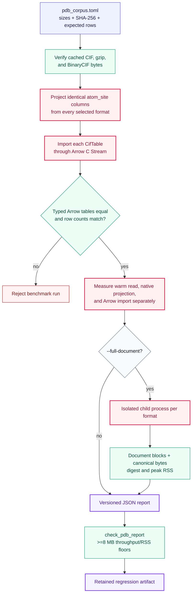

# Benchmark contract

Nibbler benchmarks publish timing only after proving that the measured result is
correct. End-to-end construction of a projected table or complete document is the unit
of work; token counters are diagnostic tools, not release evidence.

## Cross-library projection

The comparison runner projects `label_comp_id`, `Cartn_x`, `Cartn_y`, and `Cartn_z`
from `_atom_site` with Nibbler, Gemmi, Biotite, and Bio.PDB. Each engine runs in a fresh
process so imports and peak RSS are isolated. Row values are hashed with unambiguous
field boundaries, and any mismatch aborts the report. Nibbler must be a release build.

```console
make develop-release
micromamba run -p .mamba/nibbler-dev python -m benchmarks.run --list
micromamba run -p .mamba/nibbler-dev python -m benchmarks.run \
  --file tests/fixtures/chemistry/ligand_ion_water.cif --json
micromamba run -p .mamba/nibbler-dev python -m benchmarks.run \
  --synthetic-rows 100000 --warmups 1 --samples 3
```

`make benchmarks` installs the release extension and runs a smoke sample.

The JSON report records the exact command, input SHA-256, byte counts, engine versions,
platform, Python version, CPU count, warmups, samples, p50/p95/p99 latency, logical
decompressed throughput, files per second, peak RSS, row count, and semantic digest.

## PDB stress corpus

`pdb_corpus.toml` pins five structures by byte size, SHA-256, and atom count. Text and
gzip files use explicit revisions from the
[wwPDB versioned archive](https://www.wwpdb.org/ftp/pdb-versioned-ftp-site), rather
than mutable latest-entry URLs. BinaryCIF files are exact hash-pinned downloads from
RCSB because that service does not expose the same revision-addressed archive:

| ID | Workload |
| --- | --- |
| `1crn` | small protein and latency floor |
| `4hhb` | protein with ligand and metal chemistry |
| `1d3z` | multi-model NMR ensemble |
| `6qnr` | large ribosome |
| `3j3q` | 2.44-million-atom ribosomal assembly |

Fetches go to ignored `.cache/pdb-stress`; tests never require network access. A
scientific fixture update must change the manifest deliberately and prove atom counts
and projected values agree across text CIF, gzip, and BinaryCIF.

```console
micromamba run -p .mamba/nibbler-dev python -m tools.fetch_pdb_corpus
micromamba run -p .mamba/nibbler-dev python -m benchmarks.pdb_stress \
  --warmups 1 --samples 3
micromamba run -p .mamba/nibbler-dev python -m benchmarks.pdb_stress \
  --formats all --warmups 1 --samples 3
micromamba run -p .mamba/nibbler-dev python -m benchmarks.pdb_stress \
  --ids 6qnr 3j3q --formats cif --full-document --warmups 0 --samples 1
```

The staged runner measures warm file reads, native schema-typed `_atom_site`
projection, Arrow import, and optionally isolated full-document materialization. CIF,
BinaryCIF, and gzip projections must have the manifest atom count and equal Arrow
tables. Full-document workers also record peak RSS and canonical output digest.

Throughput uses source bytes for CIF and BinaryCIF, and logical decompressed CIF bytes
for gzip. Reports are workload-specific observations, never portable hardware claims.
The current qualified checkpoint is in
[../docs/performance-report.md](../docs/performance-report.md).

## Qualification pipeline

Every reported timing is downstream of corpus verification and cross-format equality.
The benchmark does not time a parser result that has not first been shown to represent
the same selected rows.



## Scheduled regression gate

`.github/workflows/pdb-regression.yml` runs the complete pinned corpus every Monday at
04:23 UTC and on manual dispatch. It uses Python 3.12, Rust 1.88, a release build, two
warmups, and seven measured samples. All three formats are projected and fully
materialized:

```console
mkdir -p benchmarks/results
micromamba run -p .mamba/nibbler-dev python -m benchmarks.pdb_stress \
  --formats all --warmups 2 --samples 7 --full-document --json \
  > benchmarks/results/pdb-regression.json
micromamba run -p .mamba/nibbler-dev python -m benchmarks.check_pdb_report \
  benchmarks/results/pdb-regression.json
```

The checker always requires equal CIF/BinaryCIF/gzip projections. Throughput and memory
floors apply only when the logical input is at least 8 MB, which excludes unstable
small-file timings. The versioned values in [`pdb_guardrails.toml`](pdb_guardrails.toml)
are deliberately broad hosted-runner regression limits, not performance claims. Peak
RSS must stay below both 4 GB and a fixed 160 MB process allowance plus eight times the
larger of the logical input and canonical document sizes. Using the decoded-document
size keeps the check comparable when BinaryCIF is substantially smaller on disk. The
complete JSON report is retained for 90 days.

## Promotion rule

A performance change is retained only when:

1. representative pinned inputs show a repeatable end-to-end win or neutral result;
2. small-file latency and peak memory remain acceptable;
3. exact projected values or canonical document bytes remain equal;
4. strict errors, resource limits, and worker-count determinism still pass; and
5. the implementation remains understandable under
   [../ENGINEERING.md](../ENGINEERING.md).

Historical measurements and non-retained approaches are isolated in
[../docs/improvement-beam.md](../docs/improvement-beam.md).
