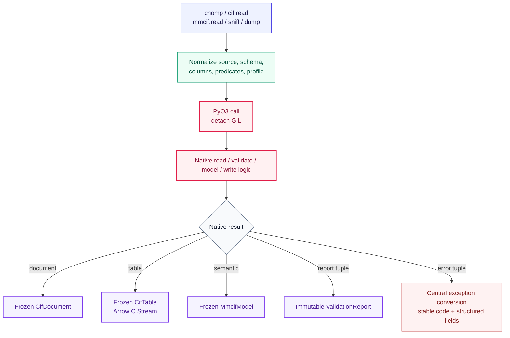
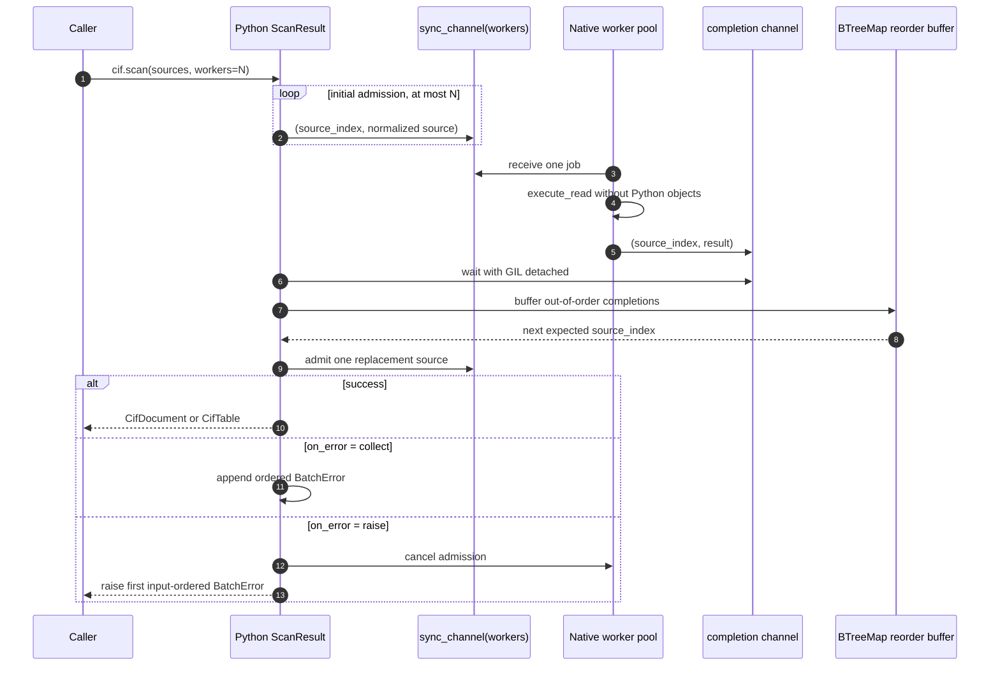
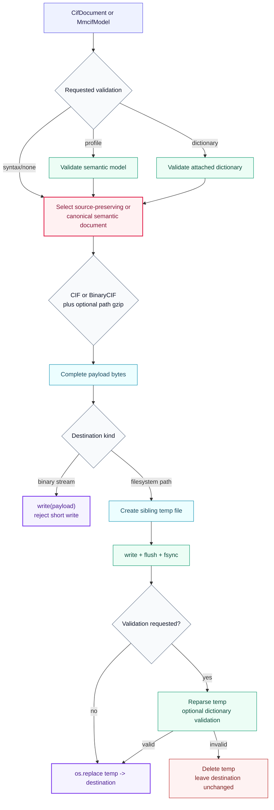

# Python boundary algorithms

`python/nibbler/` is a typed facade over the native extension. It normalizes Python
inputs, dispatches explicit public operations, converts native errors once, and owns
filesystem transaction semantics. Parsing, projection, validation, and semantic model
construction stay in Rust.

## Single-source calls

`chomp` and `feast` are exact aliases of `cif.read` and `cif.scan`. `sniff` and
`dump` dispatch through explicit schema/profile arguments and Nibbler object types.

## Bounded ordered scan

The Python iterator admits at most one source per native worker. Native completion order
may differ from input order; `BTreeMap` is the bounded reorder buffer that restores it.

Stopping early calls `ScanResult.close()`, closes admission, and joins workers while the
GIL is detached. Tables returned by scan enable source/block/frame provenance columns at
Arrow export.

## Transactional path writing

Streams are written directly and checked for short writes. Filesystem destinations use
a sibling temporary file so validation failure never replaces an existing destination.

