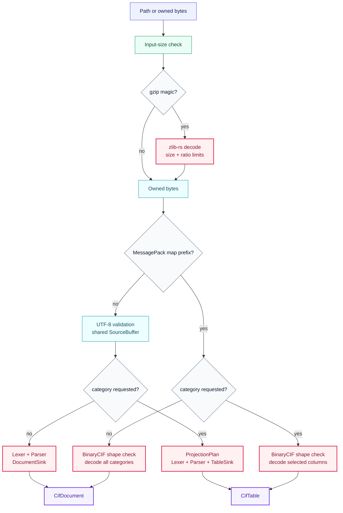
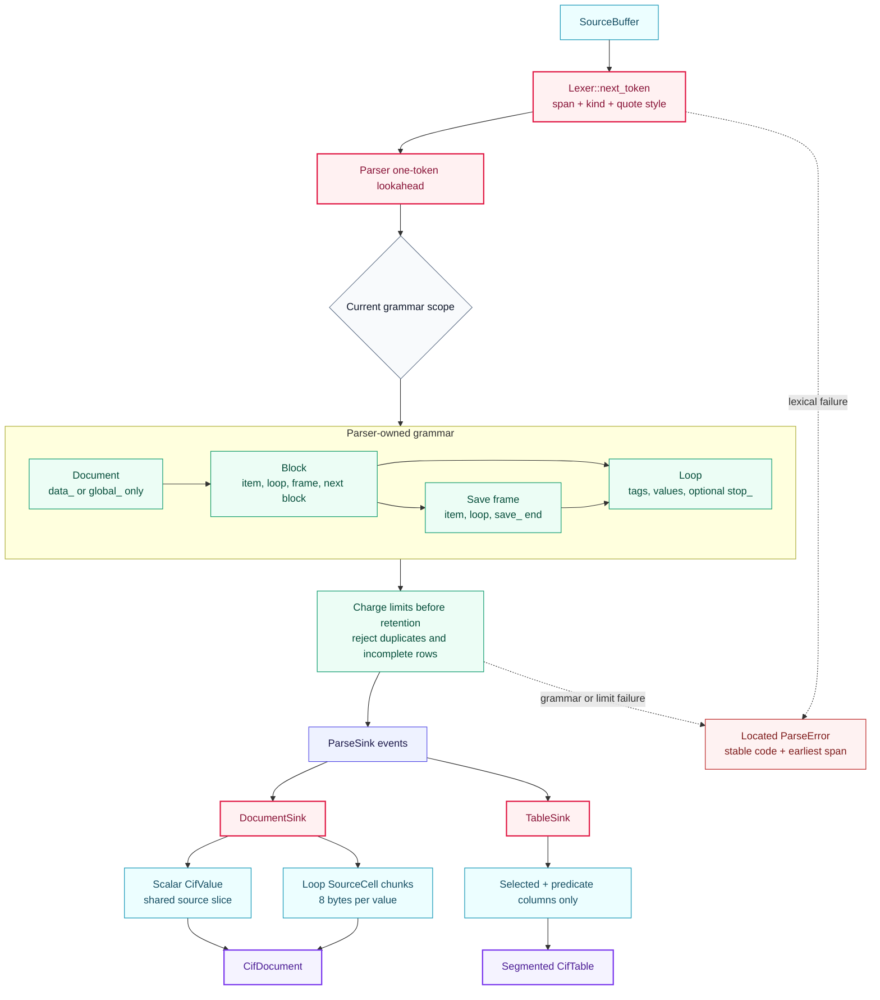
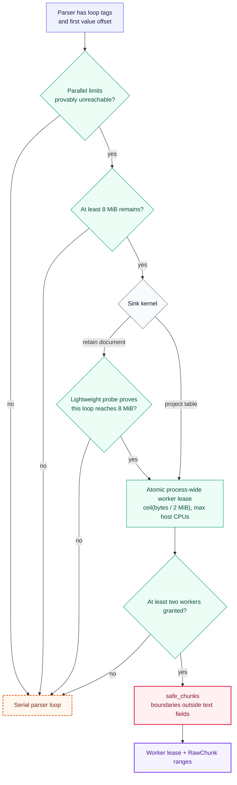
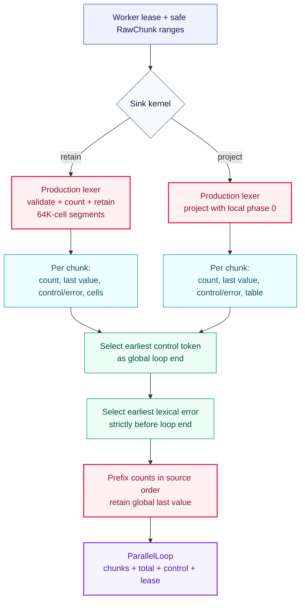
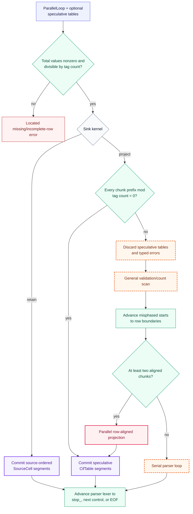
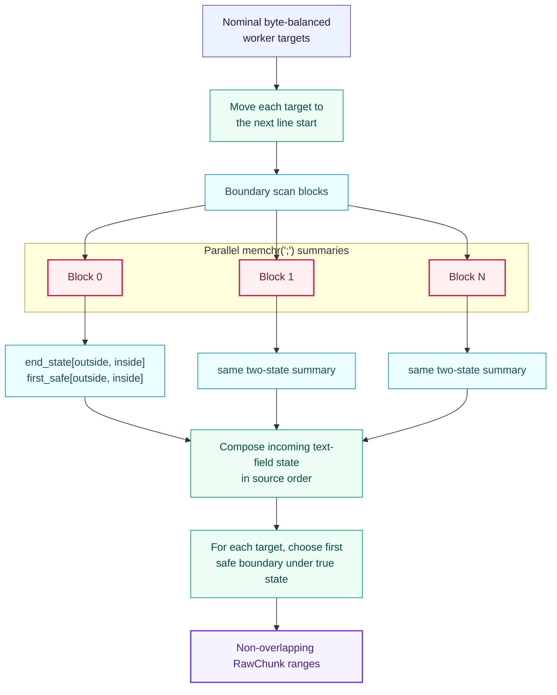
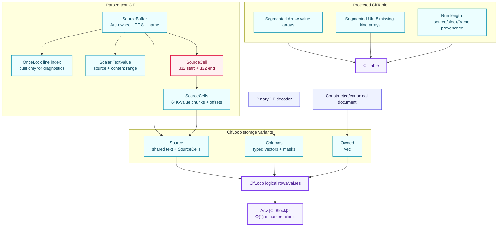
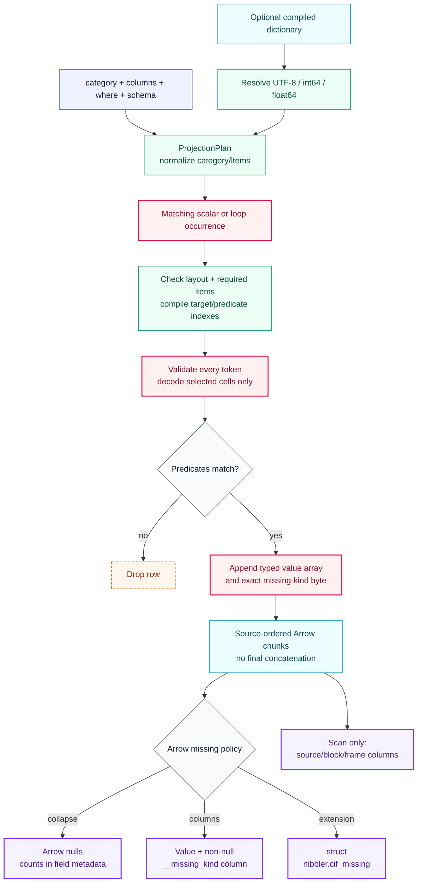
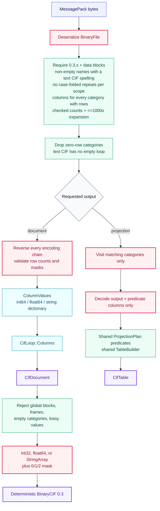
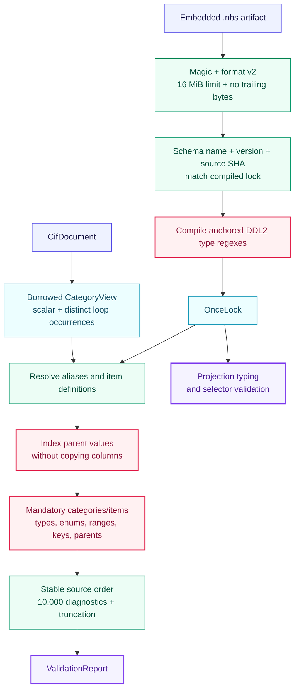

# CIF core algorithms

This directory owns generic CIF syntax, input decoding, projection, BinaryCIF,
dictionaries, validation, Arrow export, and generic serialization. The diagrams show the
current production paths. Rose nodes are CPU-hot, green nodes are proof or validation
gates, orange dashed nodes are conservative fallbacks, cyan nodes retain data, and
violet nodes are public outputs.

## Read dispatch and shared outputs

Gzip and BinaryCIF are detected from bytes, not filename suffixes. Gzip decoding happens
before the text/BinaryCIF split, so compressed BinaryCIF follows the binary branch.

Code owners: `input.rs`, `source.rs`, `parser.rs`, `projection.rs`, and `binary/`.

## One text grammar, two sinks

`Parser` is the sole owner of block, frame, scalar, loop, duplicate-tag, row-completeness,
control-word, and resource-limit rules. `ParseSink` receives events only after the parser
accepts the corresponding grammar transition.

The ordinary unquoted-token path fuses delimiter search and forbidden-character
validation in one scalar pass. Quoted values, comments, semicolon text fields, and
control words remain in the same lexer.

## Large-loop parallel kernel

This is the main text-CIF throughput path. It is an optimization under the parser, not
a second grammar. Default/custom resource limits that could alter error ordering keep a
loop serial.

### Admission and safe ranges

`parallel.rs` owns worker leases, validation, prefix counts, error arbitration, segmented
retention, speculative projection, and the row-aligned fallback. `parallel_probe.rs`
owns the allocation-free document eligibility proof.

### Parallel scan and error arbitration

### Proof and commit

## Safe boundary index

Quoted values cannot cross a line and comments end at a line ending. Only semicolon text
fields can cross a candidate line boundary, so `parallel_index.rs` summarizes the exact
two-state text-field machine instead of lexing every line serially.

Each summary is computed for both possible incoming states. The coordinator therefore
composes exact results without guessing whether an earlier block opened a text field.

## Document and table storage

The shared logical API hides three loop representations. Each representation matches
its source rather than forcing every format through a row-major object graph.

Text loop values recover quote style, missing kind, and content bounds lazily from the
two stored offsets. Sequential iteration walks chunks directly; random access uses the
chunk-offset index.

## Projection and Arrow export

Selectors are normalized before parsing. Predicate columns are assigned indexes once
per matching category occurrence, so the row loop does not search names or call Python.

`arrow.rs` emits one record batch per retained chunk through the Arrow C Stream release
callback. PyArrow and Polars take ownership of those arrays without Nibbler joining the
payload buffers.

## BinaryCIF 0.3

BinaryCIF has a separate MessagePack codec but converges on the same document, table,
missing-state, schema, and writer contracts.

## Dictionaries and validation

Built-in dictionaries are deterministic artifacts generated from lock-pinned DDL2
sources. Runtime loading is local, lazy, and immutable.

The same `CategoryView` feeds generic validation and the semantic decoders in
[`../pdbx/`](../pdbx/README.md) and [`../modelcif/`](../modelcif/README.md).
