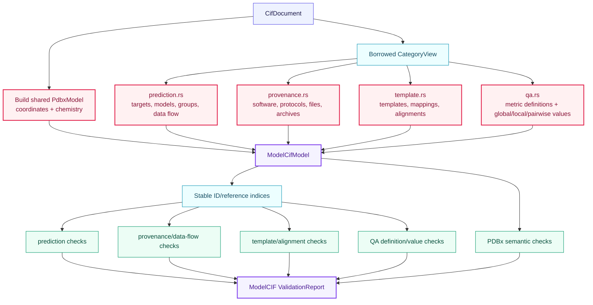
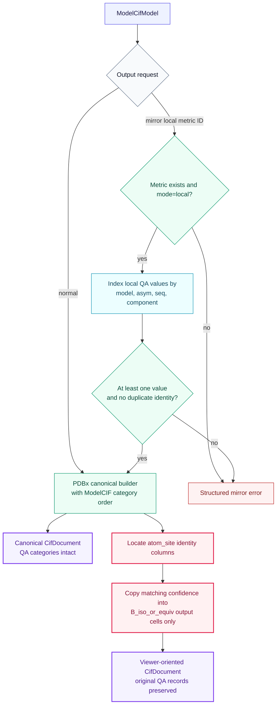

# ModelCIF semantic algorithms

ModelCIF extends the shared [`PdbxModel`](../pdbx/README.md); it does not create a second
coordinate graph. This directory owns prediction, provenance, template/alignment, QA,
file/archive, profile-validation, and optional viewer-mirroring semantics.

## Construction and validation

The four validation slices share one index-owning validator. Keeping the slices separate
makes each domain's references visible without duplicating indices or diagnostics.

## Canonical writing and explicit QA mirroring

Local prediction confidence is not a crystallographic displacement value. The normal
writer leaves B factors alone. Mirroring is a separate, explicit output view.

Preserving mode cannot mirror a metric. Pairwise or global metrics cannot be selected,
and a missing `B_iso_or_equiv` column is added only to the constructed output document.
