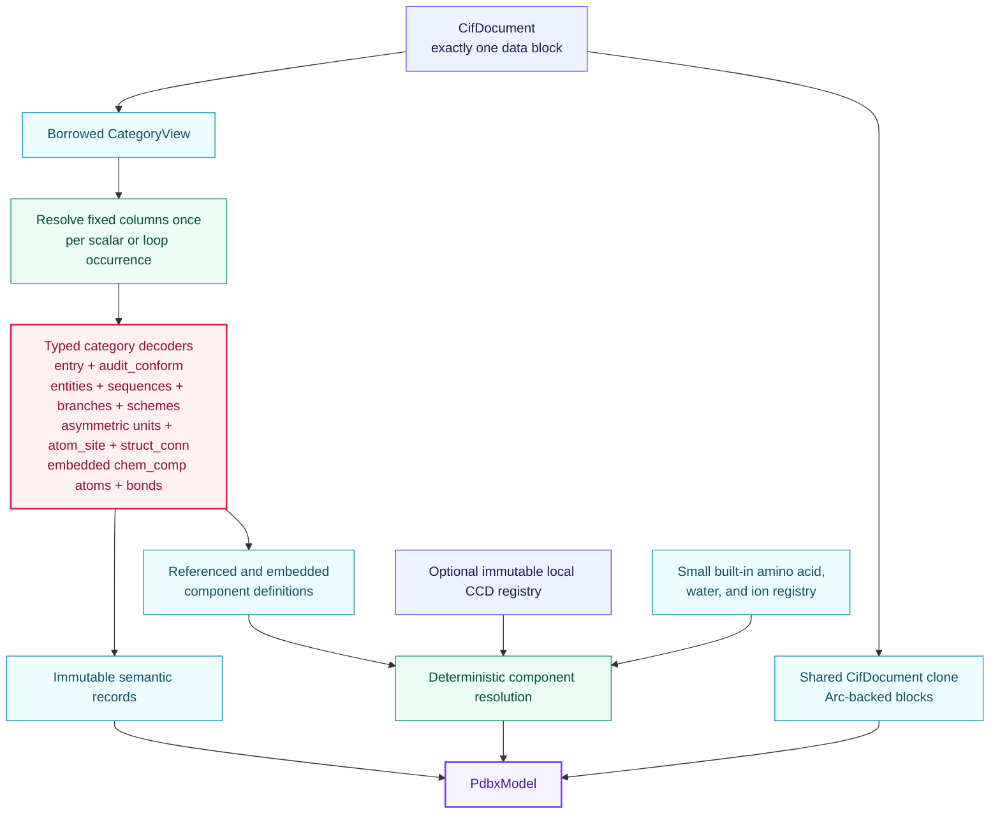
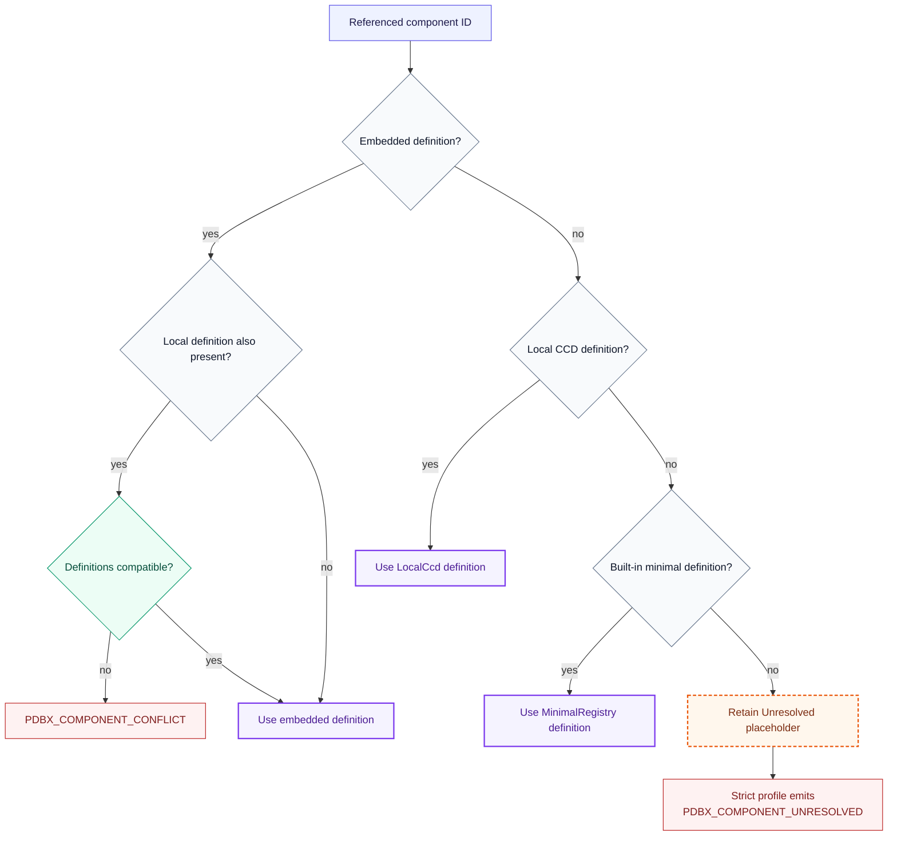
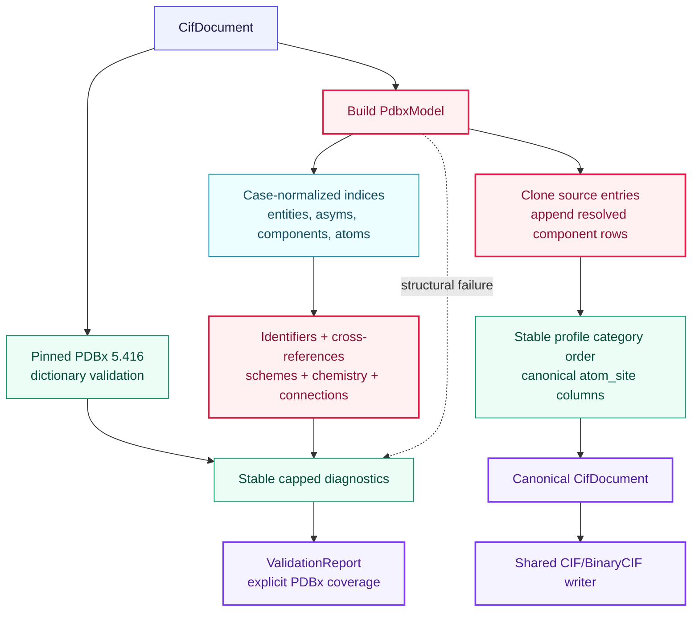

# PDBx semantic algorithms

This directory builds and validates an immutable coordinate-and-chemistry model above
the generic [`CifDocument`](../cif/README.md). It never reparses text and never fetches
chemical data from the network.

## Model construction

Every category decoder resolves its fixed columns once per scalar or loop occurrence.
Rows then read directly by column index; `_atom_site` does not allocate a map or wrapper
object for each atom.

Construction checks required identifiers and typed values. Full profile coherence is a
separate validation step, so a model may retain an explicit unresolved component and
report it deterministically.

## Component resolution

Embedded definitions have source priority, but a conflicting caller-supplied definition
is an error rather than a silent override.

## Validation and canonical output

The writer preserves all source categories, adds non-embedded resolved component
definitions when required, orders known profile categories, and delegates value quoting
and byte serialization to the generic CIF layer.
