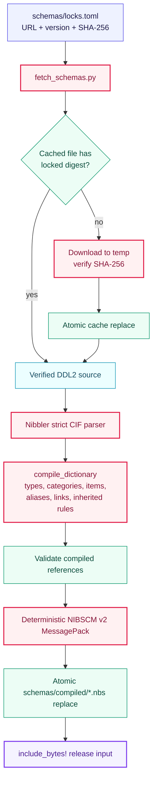
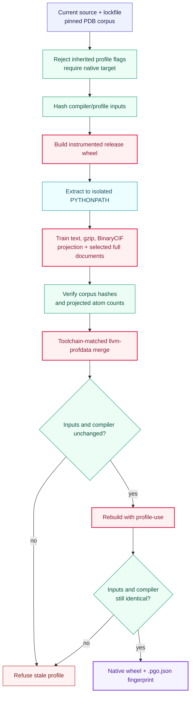
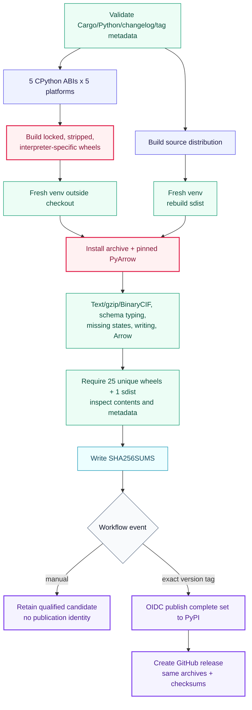

# Build and qualification workflows

These tools are side-effect boundaries around the offline library. Network access is
limited to explicit schema/corpus fetch commands; runtime parsing and validation never
fetch data.

The PDB corpus fetcher downloads immutable, revision-addressed text/gzip entries from
the wwPDB versioned archive and exact hash-pinned BinaryCIF files from RCSB. It writes
through temporary files and only promotes bytes that match the manifest.

## Lock-pinned schema supply chain

## Optional native PGO artifact

PGO is host-, compiler-, ABI-, source-, and corpus-specific. It is deliberately separate
from the portable release matrix.

## Portable release qualification

The release workflow builds 5 CPython versions on 5 platform targets plus one source
distribution. Publication credentials are unavailable until every artifact has passed
the same archive and installed-package boundary.

`qualify_release.py` installs one archive into a temporary isolated environment and
runs `installed_smoke.py` with `python -I`, preventing the checkout from satisfying an
import accidentally.
